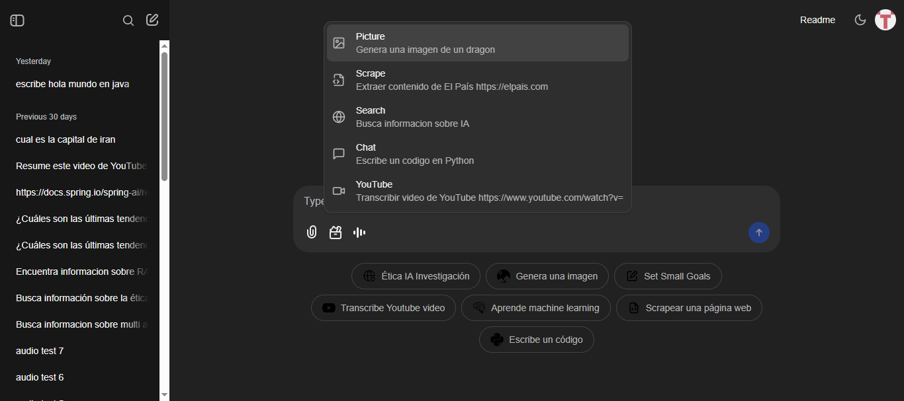

# Advanced Multimodal AI

### Feature Gallery

| Feature                          | Feature                          |
|:--------------------------------:|:--------------------------------:|
| **User Authentication**          | **Dashboard Overview**           |
|  |  |
| **Custom Command Configuration** | **AI Image Generation**          |
|  |  |
| **Web Content Extraction**       | **Document Intelligence**        |
|  |  |
| **Advanced Research**            | **Report Generation**            |
|  |  |
| **Interactive Chat**             | **Media Processing**             |
|  |  |
| **Visual Analysis**              | **Audio Comprehension**          |
|  |  |